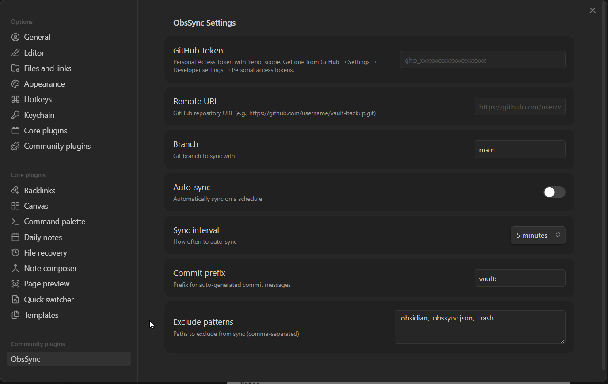

# ObsSync

Sync your Obsidian vault to a private GitHub repository. Works as both an **Obsidian plugin** and a **standalone CLI tool**.

## Features

- **Push/Pull/Sync** — commit and push vault changes to GitHub, pull remote changes
- **Auto-sync** — scheduled sync with configurable interval (1min–1hr)
- **Conflict resolution** — keep-both strategy saves `.local.md` copies, zero data loss
- **Mobile support** — uses `isomorphic-git` (pure JS), works on Obsidian mobile
- **CLI tool** — use from terminal without Obsidian
- **Flexible** — works with any folder of markdown files, not just Obsidian vaults

## Installation

### Obsidian Plugin (Manual)

1. Download `main.js` and `manifest.json` from [Releases](https://github.com/KanakSasak/ObsSync/releases)
2. Create folder: `<your-vault>/.obsidian/plugins/obssync/`
3. Copy `main.js` and `manifest.json` into that folder
4. Open **Settings** (gear icon or `Ctrl+,`)
5. Go to **Community plugins**
6. Make sure **Restricted mode** is turned **OFF**
7. Click **Installed plugins** — you should see **ObsSync** listed
8. **Toggle it ON** to enable it
9. Click the **gear icon** next to ObsSync to configure:
   - **GitHub Token** — your PAT with `repo` scope
   - **Remote URL** — your private GitHub repo URL
   - **Auto-sync** — toggle on + set interval
10. Use the **sync icon** in the left ribbon or open the command palette (`Ctrl+P`) and search for `ObsSync` commands: **Initialize vault for sync**, **Sync now**, **Push**, **Pull**, **Status**

### CLI

```bash
git clone https://github.com/KanakSasak/ObsSync.git
cd ObsSync
npm install
npm run build
```

## Usage

### Obsidian Plugin

1. Open Settings → ObsSync
2. Enter your **GitHub Personal Access Token** (needs `repo` scope)
3. Enter your **Remote URL** (e.g., `https://github.com/user/my-vault.git`)
4. Toggle **Auto-sync** on and choose an interval

**Commands** (via Command Palette `Ctrl+P`):

| Command | Description |
|---------|-------------|
| ObsSync: Initialize vault for sync | Set up git repo in your vault |
| ObsSync: Sync now | Pull + Push |
| ObsSync: Push to GitHub | Push local changes |
| ObsSync: Pull from GitHub | Pull remote changes |
| ObsSync: Show sync status | List pending changes |

### CLI

```bash
# Initialize vault
npx obssync init ./my-vault --remote https://github.com/user/vault.git --token ghp_xxx

# Push changes
npx obssync push ./my-vault -m "added new notes"

# Pull changes
npx obssync pull ./my-vault

# Full sync (pull + push)
npx obssync sync ./my-vault

# Watch mode (auto-sync on file changes)
npx obssync watch ./my-vault

# Check status
npx obssync status ./my-vault
```

Set `GITHUB_TOKEN` env var to avoid passing `--token` each time.

## Plugin Settings



| Setting | Description | Default |
|---------|-------------|---------|
| GitHub Token | PAT with `repo` scope | — |
| Remote URL | GitHub repository URL | — |
| Branch | Git branch to sync | `main` |
| Auto-sync | Enable scheduled sync | Off |
| Sync interval | Auto-sync frequency | 5 minutes |
| Commit prefix | Prefix for commit messages | `vault:` |
| Exclude patterns | Paths to skip | `.obsidian, .trash, .obssync.json` |

## Architecture

```
src/
├── core/           # Git-backend-agnostic sync logic
│   ├── types.ts        # Shared interfaces & error types
│   ├── sync-engine.ts  # Push/pull/fullSync orchestration
│   ├── conflict.ts     # Keep-both conflict resolution
│   ├── config.ts       # .obssync.json management
│   └── gitignore.ts    # .gitignore generation
├── git/            # Git provider implementations
│   ├── git-provider.ts # IGitProvider interface
│   ├── isomorphic.ts   # isomorphic-git (plugin + mobile)
│   └── simple.ts       # simple-git (CLI, wraps system git)
├── plugin/         # Obsidian plugin
│   ├── main.ts         # Plugin lifecycle & commands
│   ├── settings-tab.ts # Settings UI
│   └── fs-adapter.ts   # Vault path bridge
└── cli/            # Standalone CLI
    ├── cli.ts          # Commander commands
    └── watcher.ts      # File watcher with debounce
```

The core sync engine uses an `IGitProvider` interface, allowing two git backends:
- **isomorphic-git** — pure JS, works everywhere (plugin + mobile)
- **simple-git** — wraps system `git` binary, better performance (CLI `--simple-git` flag)

## Development

```bash
npm install
npm run dev      # watch mode, rebuilds on changes
npm run build    # production build
npm run lint     # type check
```

**Build outputs:**
- `main.js` — Obsidian plugin bundle
- `dist/cli.js` — CLI bundle

For live development in Obsidian, install the [Hot-Reload](https://github.com/pjeby/hot-reload) community plugin.

## License

MIT
